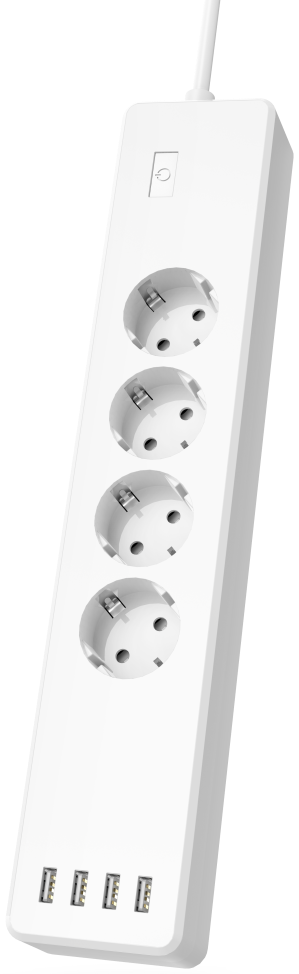
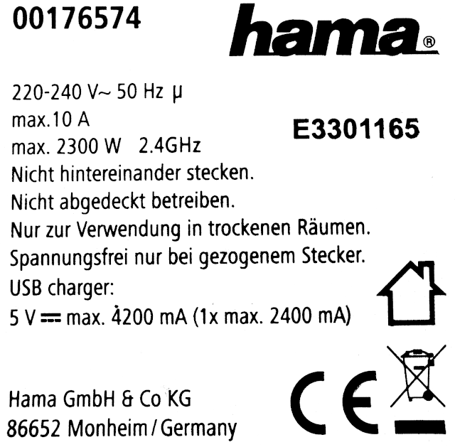

## Product Images




## Disassembly

Be aware that unscrewing the device will most likely leave you with broken screws.
So make sure you only flash firmware that allows wireless OTA updates.

## GPIO Pinout

| GPIO | Function               |
| ---- | ---------------------- |
| 1    | LED (inverted)         |
| 3    | Button (inverted)      |
| 5    | Relay (Power Socket 1) |
| 4    | Relay (Power Socket 2) |
| 12   | Relay (Power Socket 3) |
| 13   | Relay (Power Socket 4) |
| 14   | Relay (USB Socket)     |

## Basic config

```yaml file=config.yaml
```

## Advanced config

### Additional components

- **Network:**
  Enables IPv6 support
- **ESPHome OTA Updates:**
  Enables remote-installation of firmware binaries via WiFi.
- **Native API:**
  Enables communication with Home Assistant.
- **Access Point/Captive Portal:**
  Enables easy WiFi setup.

### Additional features

- **Mainswitch:**
  On turn off the current socket-states get stored, so they can get restored on turn on.
  If a relay gets turned on while the mainswitch is off, the socket-states won't be restored to prevent unpredictable behavior.
  The LED on the button indicates the state of the mainswitch.
- **Adjustable button-behavior:**
  It can be set to toggle the mainswitch, toggle any of the sockets or do nothing.
- **Button event:**
  Button-events are exposed, so they can be used in automations.
- **Offline mode:**
  A long-press (1s+) turns on all sockets to make sure they are still useable while the device is offline.

```yaml file=advanced.yaml
```
